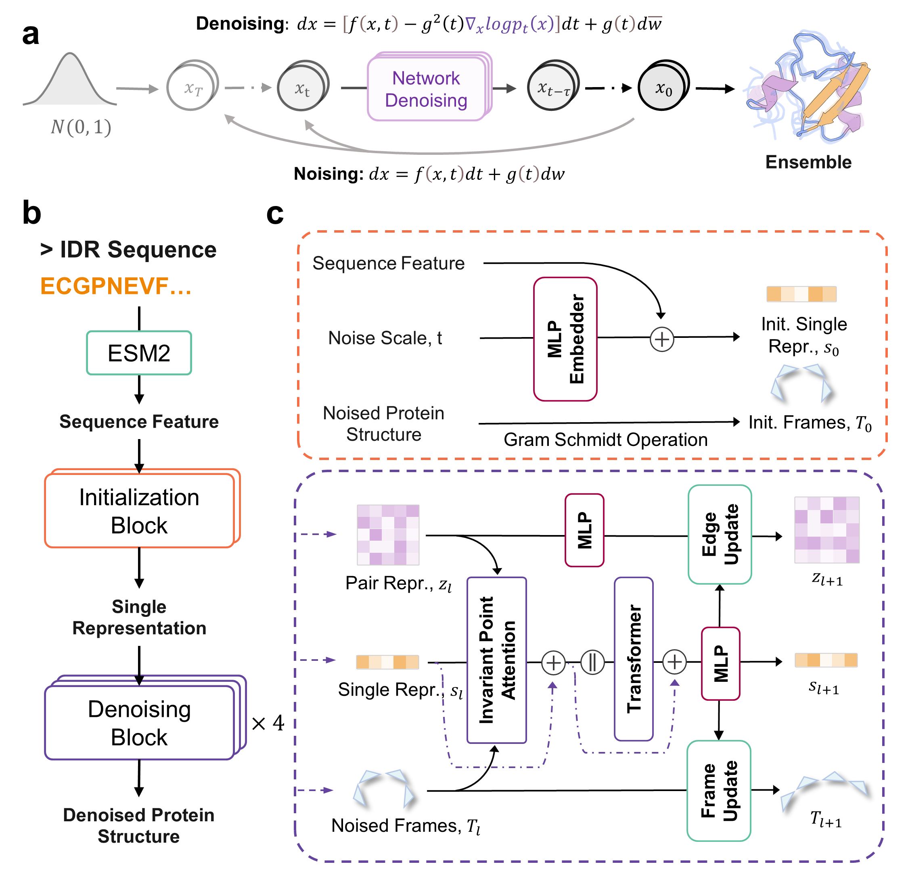

# Precise Generation of Conformational Ensembles for Intrinsically Disordered Proteins Using Fine-tuned Diffusion Models

<a href="https://pytorch.org/get-started/locally/"></a>
<a href="https://pytorchlightning.ai/"></a>
<a href="https://hydra.cc/"></a>
<a href="https://github.com/ashleve/lightning-hydra-template"></a>
[](https://www.biorxiv.org/content/10.1101/2024.05.05.592611v1)

## Overview

We developed a generative deep learning model that predict IDP conformational ensembles directly from their sequences using fine-tuned diffusion models, named as IDPFold. IDPFold bypasses the need for Multiple Sequence Alignments (MSA) or experimental data, achieving accurate predictions of ensemble properties across numerous IDPs. 

IDPFold is pretrained on the [PDB](https://www.rcsb.org/) database and fine-tuned on conformational ensembles provided by [IDRome](https://github.com/KULL-Centre/_2023_Tesei_IDRome), achieving more precise sampling of IDP ensembles than SOTA deep learning models and MD simulation.



The codebase of IDPFold is mainly inspired by [Str2Str](https://github.com/lujiarui/Str2Str), thank [Jiarui Lu](https://github.com/lujiarui) for his valuable suggestions.


## Installation

```bash
git clone https://github.com/Junjie-Zhu/IDPFold.git
cd IDPFold

# Create a new conda environment
conda env create -f environment.yml
conda activate idpfold

# Install ESM for sequence embedding extraction
pip install fair-esm

# Install IDPFold as a package
pip install -e .
```

After installation, you need to update the `.env` file with the correct paths to the data and the pretrained model. You can use the provided `.env.example` as a template.

```bash
CACHE_DIR="/path/to/.cache"
TRAIN_DATA="/path/to/train/data"  # path to pdb files for training model, please make sure the directory is not empty
EMBEDDING="/path/to/PLM/embeddings"  # path to ESM-2 embeddings, the directory can be empty for inference
TEST_DATA="/path/to/test/data"  # path to pdb files for inference, the directory can be empty for inference
```

## Inference

To generate conformational ensembles for given sequences, you should:

- Prepare a `fasta` file, both single sequence and multiple are allowed, an example has been provided in `data/example.fasta` which contains 3 IDP sequences
- Check the checkpoint file, our pretrained model checkpoints can be accessed from [Google Drive](https://drive.google.com/drive/folders/1-5BHexAZKGX1lWyPkYU-JFi1EId88P9i?usp=sharing)
- Run the following command

```bash
# Extract sequence embeddings
python src/read_seqs.py --pred_dir=/path/to/fasta/file

# Inference
python src/eval.py --ckpt_path=/path/to/ckpt
```

## Training

To be updated ...


<hr/>

This is a test version of IDPFold, if you have any question please either create an issue or directly contact shiroyuki@sjtu.edu.cn!